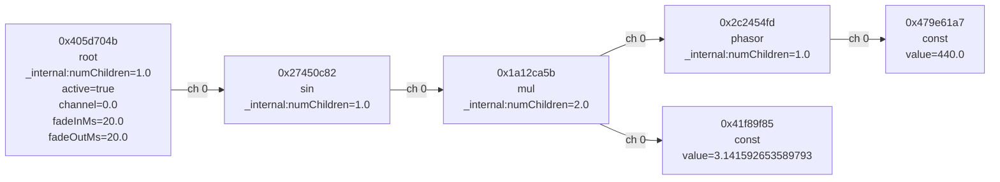

```mermaid
flowchart LR
    n0x1a12ca5b["0x1a12ca5b<br/>mul<br/>_internal:numChildren=2.0"]
    n0x27450c82["0x27450c82<br/>sin<br/>_internal:numChildren=1.0"]
    n0x2c2454fd["0x2c2454fd<br/>phasor<br/>_internal:numChildren=1.0"]
    n0x405d704b["0x405d704b<br/>root<br/>_internal:numChildren=1.0<br/>active=true<br/>channel=0.0<br/>fadeInMs=20.0<br/>fadeOutMs=20.0"]
    n0x41f89f85["0x41f89f85<br/>const<br/>value=3.141592653589793"]
    n0x479e61a7["0x479e61a7<br/>const<br/>value=440.0"]
    n0x1a12ca5b -->|ch 0| n0x41f89f85
    n0x1a12ca5b -->|ch 0| n0x2c2454fd
    n0x27450c82 -->|ch 0| n0x1a12ca5b
    n0x2c2454fd -->|ch 0| n0x479e61a7
    n0x405d704b -->|ch 0| n0x27450c82
```
