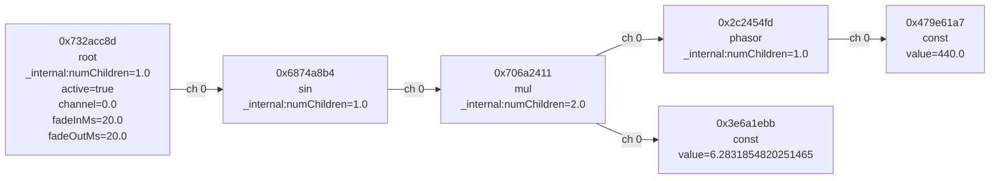

```mermaid
flowchart LR
    n0x2c2454fd["0x2c2454fd<br/>phasor<br/>_internal:numChildren=1.0"]
    n0x3e6a1ebb["0x3e6a1ebb<br/>const<br/>value=6.2831854820251465"]
    n0x479e61a7["0x479e61a7<br/>const<br/>value=440.0"]
    n0x6874a8b4["0x6874a8b4<br/>sin<br/>_internal:numChildren=1.0"]
    n0x706a2411["0x706a2411<br/>mul<br/>_internal:numChildren=2.0"]
    n0x732acc8d["0x732acc8d<br/>root<br/>_internal:numChildren=1.0<br/>active=true<br/>channel=0.0<br/>fadeInMs=20.0<br/>fadeOutMs=20.0"]
    n0x2c2454fd -->|ch 0| n0x479e61a7
    n0x6874a8b4 -->|ch 0| n0x706a2411
    n0x706a2411 -->|ch 0| n0x3e6a1ebb
    n0x706a2411 -->|ch 0| n0x2c2454fd
    n0x732acc8d -->|ch 0| n0x6874a8b4
```
